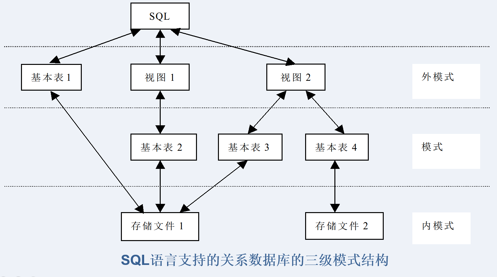

# Chapter 1

## 1. 数据库技术的产生、发展阶段

`人工管理阶段`	`文件系统阶段`	`数据库系统阶段`

## 2. 数据库系统的组成层次


## <font color = "#DE45000">3. DBS的三级模式结构</font>

> 模式(Schema)是数据库中全体数据的逻辑结构和特征的描述
>
> 

**DBS内部体系结构：**

`外模式`	`模式`	`内模式`			(三级抽象模式)

`二级映像功能`


## <font color = "#DE44AAE">4. 三级模式与二级映像的特点和优缺点</font>

**内模式：** 对数据库存储结构的描述，是数据在数据库内部的表示方式。（存储或物理模式，只有一个）

**模式：** 数据库中全体数据的逻辑结构和特征的描述。（数据库整体逻辑，只有1个）

**外模式：** 数据库用户能看到并允许使用的部分数据的逻辑结构和特征的描述。（用户视图，可有多个）


*特点：*

`外模式/模式映象`	**保证了数据与程序间的逻辑独立性**

`模式/内模式映象`	**确保了数据的物理独立性**


*优点：*

1. 保证数据的独立性；
2. 简化了用户接口；
3. 有利于数据共享；
4. 有利于数据的安全保密。

## 5. DBS的外部结构

- 单用户结构的数据库系统 
- 主从式结构的数据库系统 
- 分布式结构的数据库系统 
- 客户/服务器结构的数据库系统 
- 浏览器/服务器结构的数据库系统 

## 6. DBMS的主要功能

### 数据定义功能

定义数据的模式、外模式和内模式三级模式结构 ；模式/内模式和外模式/模式二级映象 ；有关约束条件 

### 数据操纵功能

数据库的基本操作：检索、更新（包括插入、修改、删除、查询）等

### 数据库运行管理功能

数据的安全性控制、完整性控制、多用户环境下的数据并发控制和数据库的恢复。

## 7. DBMS的数据存取过程


## 8. 数据模型的概念，分类，组成要素

数据库的框架，数据库系统的核心和基础

**三个世界：** `现实世界`	`信息世界`	`计算机世界`

*两个实体型之间的联系是指两个不同的实体集间的联系，有：* 一对一，一对多，多对多

**组成结构：** `数据结构`	`数据操作`	`数据的完整性约束`


## <font color = "#DE44AAE">9. 四种数据模型	(优缺点)	重点关系模型</font>

### 层次模型	(树状)

优：结构简单，层次分明；查询效率高；提供良好的数据完整性支持。

缺：不能直接表示多对多，插入删除数据限制多，查询子女结点必须通过双亲结点。

### 网状模型

*采用有向图结构表示记录型与记录型之间联系的数据模型*

优：可表示实体间的多种复杂联系，良好的性能和存储效率 。

缺：数据结构复杂，数据定义语言和操纵语言复杂，用户需要了解网状实现细节。

### <font color = "#DE45000">关系模型</font>	（关系 --> 二维表)

优：有严格的数学理论根据，用关系描述实体间的联系，具有更高的数据独立性、

更好的安全保密性。

缺：查询效率不如非关系模型。

------


# Chapter 2

## <font color = "#DE44AAE">1. 关系的有关概念</font>

### (1) 域

一组具有<font color = "#DEab000">相同数据类型</font>的值的集合，又称<font color = "#DEab000">值域</font>

域中包含的值的个数是域的<font color = "#DEab000">基数</font>

### (2) 笛卡尔积

D1×D2×……×Dn={（d1，d2，…，dn）|di∈Di，i=1，2，…，n}

笛卡尔积基数(值的个数)为所有域的基数累乘之积

### (3) 关系

笛卡尔积*D*1×*D*2×…×*D*n的任一子集称为定义在域*D*1，*D*2，…，*D**n*上的n元关系（Relation）

## 2. 关系模式	R(U, D, DOM, F)

*关系的描述称为关系模式（Relation Schema）*

R--关系名 

U--属性名集合 

D--属性所来自的域 

DOM--属性向域的映像集合 

F--属性间数据的依赖关系集合 

*关系头	关系体*

## <font color = "#DE44AAE">3. 关系的"码"	(主码, 候选码, 全码, 外码)</font>

###　候选码（Candidate Key）[唯一性] [最小性]

*能唯一标识关系中元组的一个属性或属性集*（**能唯一决定这条元组其他属性值的最小的属性集合**）

### 主码（Primary Key） 

*从多个候选码中选择一个作为查询、插入或删除元组的操作变量，被选用的候选码称为 主码。*(**每个关系必须选择一个主码 ，且不能随意改变**)

### 主属性（Prime Attribute）与非码属性（Non-Prime Attribute） 

*主属性：包含在主码中的各个属性称为主属性*

*非码属性：不包含在任何候选码中的属性称为非主属性（或非码属性）*

### 全码（All Key）

*所有属性的组合是关系的候选码*(**必须将该关系所有属性全部算上才能决定一条元组，任何属性组都不能唯一确定元组**)

### 外码（Foreign Key）

*一个关系里的一个或一组属性不是该关系主码,，而是另一关系的主码，则为该关系的外码。*

（**一个关系里某个引用另一关系主码的属性(集)**）

## 4. 关系的完整性约束

1. **实体完整性 （Entity Integrity）：**主码的值不能为空或部分为空 。
2. **参照完整性（Referential integrity）：**如果关系R2的外码X与关系R1的主码相符，则X的每个值或者等于R1中主码的某一个值，或者取空值。
3. **用户自定义完整性（User-defined Integrity）：**针对某一具体关系数据库的约束条件，反映某一具体应用所涉及的数据必须满足的语义要求。

## 5. 关系代数运算符

*关系代数是一种抽象的查询语言，其运算对象与运算结果都是关系*

> **关系代数的运算符：**
>
> 

|                                 |              **R**              |                                 | ---  |                                 |              **S**              |                                 |
| :-----------------------------: | :-----------------------------: | :-----------------------------: | :--: | :-----------------------------: | :-----------------------------: | :-----------------------------: |
|                A                |                B                |                C                |      |                A                |                B                |                C                |
| <font color = "green">a1</font> | <font color = "green">b1</font> | <font color = "green">c1</font> |      | <font color = "green">a1</font> | <font color = "green">b1</font> | <font color = "green">c1</font> |
|               a1                |               b1                |               c2                |      | <font color = "blue">a2</font>  | <font color = "blue">b2</font>  | <font color = "blue">c1</font>  |
| <font color = "blue">a2</font>  | <font color = "blue">b2</font>  | <font color = "blue">c1</font>  |      |               a2                |               b3                |               c2                |

|        | **R∪S** |        | ---  |        | **R∩S** |        | ---  |        | **R-S** |        |
| :----: | :-----: | :----: | :--: | :----: | :-----: | :----: | :--: | :----: | :-----: | :----: |
|   A    |    B    |   C    |      |   A    |    B    |   C    |      |   A    |    B    |   C    |
| **a1** | **b1**  | **c1** |      | **a1** | **b1**  | **c1** |      | **a1** | **b1**  | **c2** |
| **a1** | **b1**  | **c2** |      | **a2** | **b2**  | **c1** |      |        |         |        |
| **a2** | **b2**  | **c1** |      |        |         |        |      |        |         |        |
| **a2** | **b3**  | **c2** |      |        |         |        |      |        |         |        |

**R×S**

|                A                |                B                |                C                |                A                |                B                |                C                |
| :-----------------------------: | :-----------------------------: | :-----------------------------: | :-----------------------------: | :-----------------------------: | :-----------------------------: |
| <font color = "green">a1</font> | <font color = "green">b1</font> | <font color = "green">c1</font> | <font color = "green">a1</font> | <font color = "green">b1</font> | <font color = "green">c1</font> |
| <font color = "green">a1</font> | <font color = "green">b1</font> | <font color = "green">c1</font> | <font color = "blue">a2</font>  | <font color = "blue">b2</font>  | <font color = "blue">c1</font>  |
| <font color = "green">a1</font> | <font color = "green">b1</font> | <font color = "green">c1</font> |               a2                |               b3                |               c2                |
|               a1                |               b1                |               c2                | <font color = "green">a1</font> | <font color = "green">b1</font> | <font color = "green">c1</font> |
|               a1                |               b1                |               c2                | <font color = "blue">a2</font>  | <font color = "blue">b2</font>  | <font color = "blue">c1</font>  |
|               a1                |               b1                |               c2                |               a2                |               b3                |               c2                |
| <font color = "blue">a2</font>  | <font color = "blue">b2</font>  | <font color = "blue">c1</font>  | <font color = "green">a1</font> | <font color = "green">b1</font> | <font color = "green">c1</font> |
| <font color = "blue">a2</font>  | <font color = "blue">b2</font>  | <font color = "blue">c1</font>  | <font color = "blue">a2</font>  | <font color = "blue">b2</font>  | <font color = "blue">c1</font>  |
| <font color = "blue">a2</font>  | <font color = "blue">b2</font>  | <font color = "blue">c1</font>  |               a2                |               b3                |               c2                |


##  <font color = "#DE45000">6. 专门的关系运算【大题】(σ选取,  Π 投影,  θ 连接 ,  ÷ 除法)</font>

### (1) 选取（Selection）


### (2) 投影（Projection）


### (3) θ 连接（ **θ** Join）


**自然连接要求相等属性值的属性名相同，等值连接不要求；*自然连接是去掉重复列的等值连接***

### (4) 除法（Division）


# Chapter 3

## 1. Structured Query Language 关系数据库的标准语言

**基本概念：**结构化查询语言，包含数据查询、数据定义、数据操纵、 数据控制 。

*基本表（Base Table）* ：一个关系对应一个基本表 、一个或多个基本表对应一个存储文件。

*视图（View）*：视图是从一个或几个基本表导出的表，是一个虚表，无数据。




**特点：**

1. 自然语言，简洁易用
2. 一体化的、非过程化的、一种面向集合的语言 
3. 既是自含式语言，又是嵌入式语言
4. 具有数据查询、数据定义、数据操纵和数据控制四种功能 

## 2. 数据库的创建、修改、删除的基本语句

### *1. 创建数据库的SQL命令的语法格式：*

```sql
CREATE DATABASE 数据库名称	-- 括号内容可省略
[ON
[FILEGROUP 文件组名称]		-- 用[]括起来的语句，表示在创建的过程中可以选用或者不选用
(  NAME=数据文件逻辑名称,
  FILENAME='路径+数据文件名',  SIZE=数据文件初始大小,
  MAXSIZE=数据文件最大容量,
  FILEGROWTH=数据文件自动增长容量, )]	-- “FILEGROWTH”可以是具体的容量，也可是UNLIMITED
[LOG ON
(  NAME=日志文件逻辑名称,	  -- 用()括起来的语句，除最后一行，其余命令都用逗号作为分隔符
  FILENAME='路径+日志文件名',  SIZE=日志文件初始大小,
  MAXSIZE=日志文件最大容量,
  FILEGROWTH=日志文件自动增长容量, )]
[COLLATE 数据库校验方式名称]		
[FOR ATTACH]			-- FOR ATTACH”表示将已经存在的数据库文件附加到新的数据库中
```

> [例3-1] 用SQL命令创建一个教学数据库Teach，数据文件的逻辑名称为Teach_Data，数据文件存放在E盘根目录下，文件名为TeachData.mdf，数据文件的初始存储空间大小为10MB，最大存储空间为500MB，存储空间自动增长量为10MB；日志文件的逻辑名称为Teach_Log，日志文件物理地存放在E盘根目录下，文件名为TeachData.ldf，初始存储空间大小为5MB，最大存储空间为500MB，存储空间自动增长量为5MB。
>
> ``` sql
> CREATE DATABASE Teach
> ON
> (  NAME=Teach_Data,
>  FILENAME='D:\TeachData.mdf ',
>  SIZE=10,
>  MAXSIZE=500,
>  FILEGROWTH=10)
> LOG ON
> (   NAME=Teach_Log,
>  FILENAME='D:\TeachData.ldf ',
>  SIZE=5,
>  MAXSIZE=500，
>  FILEGROWTH=5)
> ```

### *2. SQL命令修改数据库*

使用ALTER DATABASE命令修改数据库。(注意，只有数据库管理员或者具有CREATE DATABASE权限的人员才有权执行)

```sql
ALTER DATABASE 数据库名称
ADD FILE(
        具体文件格式)
```

ADD FILE：向数据库中添加数据文件。

ADD LOG FILE：向数据库中添加日志文件。

REMOVE FILE：从数据库中删除逻辑文件，并删除物理文件。如果文件不为空，则无法删除。

MODIFY FILE：指定要修改的文件。

ADD FILEGROUP：向数据库中添加文件组

### *3. 用SQL命令删除数据库*

```sql
DROP DATABASE 
数据库名称[,...n]
```

## 3. 数据表的创建和使用

> CREATE TABLE <表名> 
>
> (<列定义>[{，<列定义>|<表约束>}])
>
> **列定义：<列名> <数据类型> [DEFAULT] [{<列约束>}]** 

```sql
-- [例3-6]  用SQL命令建立一个学生表S。
	CREATE TABLE S
	(  SNo CHAR(6),
	   SN VARCHAR(10),
	   Sex NCHAR(1) DEFAULT '男',  -- 缺省值(默认值)为“男” 
	   Age INT,
	   Dept NVARCHAR(20))

```

### *完整性约束*

​		` [CONSTRAINT <约束名> ] <约束类型> `

NULL/NOT NULL 	UNIQUE**（唯一约束）**	PRIMARY KEY 	FOREIGN KEY 	CHECK(检查字段值所允许的范围)

```sql
-- [例3-14]  建立包含完整性定义的学生表S。
  CREATE TABLE S
  (  SNo VARCHAR(6) CONSTRAINT S_Prim PRIMARY KEY,
      SN NVARCHAR(10) CONSTRAINT SN_Cons NOT NULL,
      Sex NCHAR(1) CONSTRAINT Sex_Cons NOT NULL DEFAULT '男',
      Age INT CONSTRAINT Age_Cons NOT NULL 
              CONSTRAINT Age_Chk CHECK (Age BETWEEN 15 AND 50),
      Dept NVARCHAR(20) CONSTRAINT Dept_Cons NOT NULL)
```

### *SQL修改数据表*

```sql
ALTER TABLE <表名>
ADD <列定义> | <完整性约束定义>

ALTER TABLE <表名>
ALTER COLUMN <列名> <数据类型> [NULL | NOT NULL] 

ALTER TABLE<表名>
DROP CONSTRAINT <约束名> 

-- 删除基本表 
DROP TABLE <表名>		-- 只能删除自己建立的表
```


## <font color = "#DE45000">4. 单关系表的数据查询【大题】</font>

### *查询结构*

```sql
SELECT [ALL|DISTINCT][TOP N [PERCENT][WITH TIES]]  -- SELECT相当于投影
〈列名〉[AS 别名1] [{，〈列名〉[ AS 别名2]}]
FROM〈表名〉[[AS] 表别名]
[WHERE〈检索条件〉]								  -- where相当于选取
[GROUP BY <列名1>[HAVING <条件表达式>]]			 -- 分组
[ORDER BY <列名2>[ASC|DESC]]          			 -- 排序 (升,降)
```

### *1. 无条件查询*

只包含“SELECT…FROM”的查询，相当于只对关系进行投影

```sql
-- [例3-20]  查询全体学生的学号、姓名和年龄。	SELECT SNo, SN, Age	FROM S
```

### *2. 条件查询*

|                **常用的比较运算符**                |   **含义**   |
| :------------------------------------------------: | :----------: |
|            **=, >, <, >=, <=, != ,< >**            | **比较大小** |
| **NOT, AND, OR**  优先级从高到低，可以使用括号改变 | **多重条件** |
|                  **BETWEEN AND**                   | **确定范围** |
|                       **IN**                       | **确定集合** |
|                      **LIKE**                      | **字符匹配** |
|                    **IS NULL**                     |   **空值**   |

```sql
-- (多重条件)-- [例3-26]查询选修C1或C2且分数大于等于85分学生的学号、课程号和成绩。SELECT SNo, CNo, ScoreFROM SCWHERE (CNo = 'C1' OR CNo = 'C2') AND (Score >= 85)-- (确定范围)-- [例3-28]查询工资不在1000元～1500元间的教师的教师号、姓名及职称。SELECT TNo,TN,ProfFROM TWHERE Sal NOT BETWEEN 1000 AND 1500-- (确定集合)-- [例3-29]查询选修C1或C2的学生的学号、课程号和成绩。SELECT SNo, CNo, Score FROM SC WHERE CNo IN('C1'，'C2')/*此语句也可以使用逻辑运算符“OR”实现。	WHERE CNo='C1'OR CNo= 'C2'利用“NOT IN”可以查询指定集合外的元组。*/-- (部分匹配查询) LIKE或NOT LIKE进行部分匹配查询（模糊查询）-- [例3-34]查询姓名中第二个汉字是“力”的教师号和姓名。SELECT TNo, TN 			-- 通配符: 1. % 代表0个或多个字符FROM T					-- 2. _(下划线) 代表一个字符WHERE TN LIKE '_力%'	   -- 3. []  表示某一范围的字符,如[0-9]						-- 4. [^] 不在某一范围的字符,如[^0-9]是不在0-9之间的字符-- 空值查询 (空值不占任何空间)-- [例3-33]  查询没有考试成绩的学生的学号和相应的课程号。SELECT SNo, CNoFROM SCWHERE Score IS NULL
```

### *3. 常用库函数及统计汇总查询*

| **函数名称** |      **功 能**       |
| :----------: | :------------------: |
|   **AVG**    |  **按列计算平均值**  |
|   **SUM**    | **按列计算值的总和** |
|   **MAX**    | **求一列中的最大值** |
|   **MIN**    | **求一列中的最小值** |
|  **COUNT**   |   **按列值计个数**   |

```sql
-- [例3-34]  求学号为S1的学生的总分和平均分。	SELECT SUM(Score) AS TotalScore, AVG(Score) AS 	AvgScore	FROM SC	WHERE (SNo = 'S1')	-- [例3-35]  求选修C1号课程的最高分、最低分及之间相差的分数。	SELECT MAX(Score) AS MaxScore, MIN(Score) AS 	MinScore, MAX(Score)－MIN(Score) AS Diff	FROM SC	WHERE (CNo = 'C1')-- [例3-37]  求学校总共有多少个系。	SELECT COUNT(DISTINCT Dept) AS DeptNum	FROM S		-- DISTINCT消去重复行 -- [例3-38]  统计有成绩同学的人数。	     SELECT COUNT (Score) 	     FROM SC -- 成绩为0的同学也计算在内，没有成绩（即为空值）的不计算-- [例3-39]  利用特殊函数COUNT(*)求计算机系学生的总数。	SELECT COUNT(*) FROM S -- COUNT（*）用来统计元组的个数，不消除重复行，	WHERE Dept='计算机'	-- 不允许使用DISTINCT关键字。
```

### *4. 分组查询*

GROUP BY子句可以将查询结果按属性列或属性列组合在行的方向上进行分组，每组在属性列或属性列组合上具有相同的值。

```sql
-- [例3-40]  查询各个教师的教师号及其任课的门数。	SELECT TNo,COUNT(*) AS C_Num	FROM TC	GROUP BY TNo/*GROUP BY子句按TNo的值分组，所有具有相同TNo的元组为一组，对每一组使用函数COUNT进行计算，统计出各位教师任课的门数。*/-- [例3-41]  查询选修两门以上（含两门）课程的学生的学号和选课门数。	SELECT SNo, COUNT(*) AS SC_Num	FROM SC	GROUP BY SNo	HAVING (COUNT(*) >= 2) -- having 按照一定条件进行筛选/*具有相同SNo的元组为一组，每组使用COUNT统计出每位学生选课的门数，HAVING子句去掉不满足COUNT（*）>=2的组。 */
```

### *4.查询结果的排序* 

**ORDER BY子句必须出现在其他子句之后。排序方式可以指定，DESC为降序，ASC为升序，缺省时为升序。**

```sql
-- [例3-42]查询选修C1的学生学号和成绩，并按成绩降序排列。	SELECT SNo, Score	FROM SC	WHERE (CNo = 'C1')	ORDER BY Score DESC-- [例3-43]查询选修C2，C3，C4或C5课程的学号、课程号和成绩，查询结果按学号升序排列，学号相同再按成绩降序排列。	SELECT SNo, CNo, Score	FROM SC	WHERE CNo IN ('C2', 'C3', 'C4', 'C5’)	ORDER BY Sno, Score DESC
```


## 5. 数据表中数据的操纵（增、删、改）

*添加新纪录*

```sql
-- [例3-63]在SC表中添加一条选课记录('S7', 'C1’)。	INSERT INTO SC (SNo, CNo)	VALUES ('S7', 'C1') -- 添加多行记录INSERT INTO <表名> [(<列名1>[,<列名2>…])]子查询-- [例3-64]  求出各系教师的平均工资，把结果存放在新表AvgSal中。-- 1. 首先建立新表AvgSal，用来存放系名和各系的平均工资。CREATE TABLE AvgSal(  Department VARCHAR(20),    Average SMALLINT )-- 2. 然后利用子查询求出T表中各系的平均工资，把结果存放在新表AvgSal中。INSERT INTO AvgSalSELECT Dept,AVG(Sal) FROM TGROUP BY Dept
```

*修改数据表中数据*

```sql
-- 格式UPDATE <表名>SET <列名>=<表达式> [,<列名>=<表达式>]…[WHERE <条件>] -- [例3-65]  把刘伟老师转到信息系UPDATE T SET Dept= '信息'WHERE SN= '刘伟'-- [例3-67]  把教师表中工资小于或等于1000元的讲师的工资提高20%。UPDATE TSET Sal = 1.2 * SalWHERE (Prof = '讲师 ') AND (Sal <= 1000)
```

*删除表中数据*

```sql
-- 格式DELETE FROM<表名>[WHERE <条件>]-- [例3-70]  删除刘伟老师的记录。DELETE FROM T WHERE TN= '刘伟' -- [例3-72]  删除刘伟老师授课的记录。DELETE FROM TCWHERE (TNo =       		( SELECT TNo         	  FROM T         	  WHERE TN = '刘伟'            )      )
```

## 6. 视图

``` sql
-- [例3-73]  创建一个计算机系教师情况的视图Sub_T。CREATE VIEW Sub_T 	AS  SELECT TNo, TN, Prof   	FROM T     WHERE Dept = '计算机'    -- [例3-75]  创建一学生平均成绩视图S_Avg。CREATE VIEW S_Avg(SNo, Avg)AS SELECT SNo, Avg(Score)FROM SCGROUP BY SNo-- 修改视图ALTER VIEW <视图名>[(<视图列表>)]AS <子查询>-- 删除视图DROP VIEW <视图名>
```


## 7. 索引

---

# Chapter 4

## <font color = "#DE45000">关系模式的范式</font>

### 1. 第一范式

### 2. 第二范式

### 3. 第三范式

### 4. BC范式


---

# Chapter 5

## 1. 数据库安全性

**含义**

**三级安全性：**

## 2. 完整性控制

含义

**组成：**

**分类：**

## 3. 并发控制

**数据库并发性：**

**事务（Transaction）：**

特征

---

# Chapter 6

## 1. 数据库设计的内容、阶段、方法、步骤

## <font color = "#DE45000">2. 概念结构设计 【大题 E-R图】</font>

