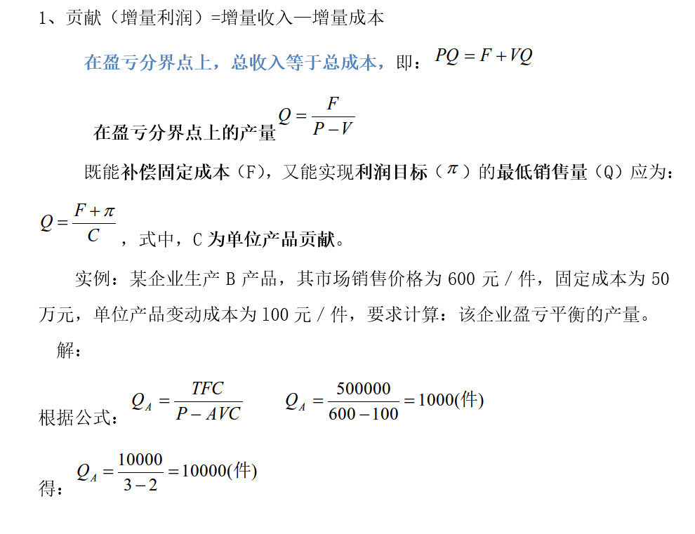
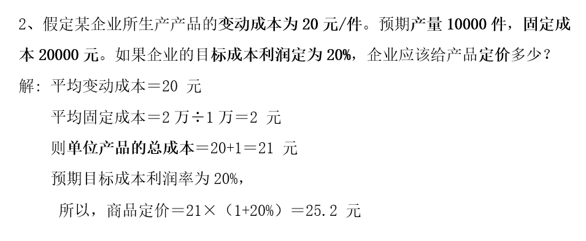
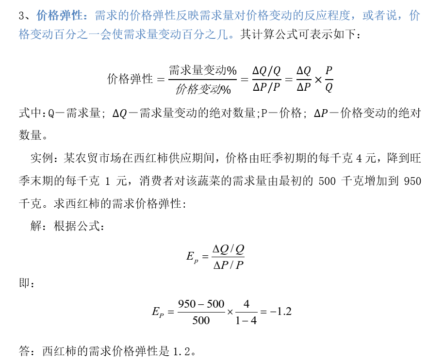

---
管理经济学 综合
---

# 一、基础知识

1. 管理经济学的基本分析方法有 <mark>边际分析法 </mark>、<mark>最优化分析法</mark>、<mark>博弈分析法</mark>。
2. 在影响需求的其他因素既定的条件下，商品的需求量与其价格之间存在着的  <mark>反向</mark>的依存关系。
3. 需求量的变动是指在其他条件不变的前提下，由于商品价格变化所引起的消费者愿意并有能力购买的商品数量的变化。这种需求量的变化在需求曲线上表现为<mark>沿着需求曲线的点移动</mark>。
4. 需求曲线向右上方平行移动，表明市场总需求增加，而需求曲线向<mark>左下方平行移动</mark>，则表明市场总需求减少。
5. 需求估计是客观地反映需求量。与各个影响因素变量之间关系的方法。
6. 定量预测法是根据<mark>统计数据</mark>，运用数学分析技术，建立表现变量间数量关系的模型进行预测的方法。
7. 管理经济学的研究对象是<mark>企业的经营决策问题</mark>。
8. 供需均衡原理揭示了<mark>以价格为中心</mark>的市场机制。它研究影响市场供给与市场需求的有关变量及其相互之间的关系。
9. 需求的变动是指在<mark>价格不变</mark>的前提下，由于其他因素（如消费者收入、相关商品的价格等）发生变化而引起的整个供求关系的变化。
10. 划分市场结构的关键标准就是<mark>市场集中度</mark>。
11. 风险就是预期收益不能实现的 <mark>可能性和概率</mark>。
12. 定性预测法是通过分析历史资料和研究未来条件，凭借预测人员的<mark>经验和判断推理能力</mark>进行预测的方法。

# 二、基本概念

1. **边际分析法：**管理经济学中，边际被用于揭示两个有因果或相关关系的经济变量之间的动态函数关系。

2. **机会成本原理：**机会成本原理是研究伴随某项经营决策而产生的机会损失（这是一种无形损失）以及这种损失对决策行为的影响。
3. **收入效应：**当一种商品价格下降时，从财富存量角度衡量的消费者收入会相应增加的效应。由于消费者收入是影响商品需求的因素之一，因此，收入增加会导致对该种商品的消费量相应增加，这就是收入效应。
4. **盈亏平衡分析：**又叫量本利分析，是根据企业的产量、成本、利润三者之间的相互关系进行综合分析，从而提高经济效益的方法。盈亏平衡分析的关键是寻找盈亏平衡点。盈亏平衡点是指使销售收入与总成本相等时的数量。
5. **完全垄断市场：**也称独占市场，是指一个行业市场所需要的全部产品只有一家企业提供，而且它的产品不存在相近的替代品，新企业因为种种限制而无法进入该行业。
6. **最优化分析法：**最优化分析法就是将决策学中的最优化方法运用于分析、管理决策过程，以求最优解的方法。
7. **替代效应：**当一种商品的价格下降时，这种商品相对于其替代品而言，就变得相对便宜，那么消费者就会增加对这种商品的消费，从而减少对其替代品的消费，这就是替代效应。
8. **卡特尔：**是指生产或销售某一同类商品的企业，为了垄断独占市场及获取高额利润，通过在商品价格、产量、销售区域、市场份额、专利使用等方面订立协定而形成的同盟。
9. **信息不对称性：**如果某些信息一部分人知道而另一部分人不知道，或者一部分人知道的多而另一部分人知道的少，市场上的信息就是不对称的。
10. **政府失灵：**政府失效，指政府为弥补市场失灵而对经济、社会生活进行干预的过程中，由于政府行为自身的局限性和其他客观因素的制约而产生的缺陷，进而无法使社会资源配置效率达到最佳的情景。

# 三、基础理论

1. **什么是商品定价目标？包括哪些内容？**

企业定价目标是指企业希望通过定价活动所要达到的目的或意图。

企业定价目标主要有利润、竞争、市场份额、价格稳定四个，还有诸如投资收益、销售额、产品或企业形象、顾客满意度等其他定价目标。

2. **资金成本的构成包括哪些内容？**

​	（1）债务成本。举债筹资的成本就是企业付给借款人（债权人）的利息。如果企业缴纳所得税，因利息支出可以从应纳税收入中扣去，从而可以减免一部分税金，所以，税后的债务成本就会低于利息率。

​	（2）权益资本的成本。权益资本包括普通股、优先股和留存盈余三种。

​	（3）资本的综合成本。其综合成本实际就是不同资金来源成本的加权平均值。

3. **最常见的企业风险主要涉及哪些因素？**

 *风险因素起源于企业的内部条件和外部环境。*

内部条件包括资金、技术、人力、管理、策略等软硬件资源方面的风险因素；

外部环境包括市场、需求、竞争、政治、文化、法律等方面的宏观风险因素。

4. **需求的价格弹性理论对于企业的经营决策有何启示？请举例说明。**

企业通常采取调整价格的措施来提高利润。

对于需求富有弹性的商品来说, 该商品的价格策略应采取“薄利多销”策略, 即低价或降价策略。

而对于需求缺乏弹性的商品来说, 应采取稳中有升价格策略。对于缺乏需求价格弹性的商品, 可以采取适当高价策略。

5. **什么是市场效率？衡量市场效率的标准是什么？**

（1）市场效率**含义**。

*市场效率是指市场在配置资源方面的效率。*

在发展经济和提高资源配置效率方面市场机制显示出了巨大的优越性。

这种优越性的主要体现在：

1) 极大地激发了人们为积累财富而从事社会经济活动的热情；
2) 市场经济活动导致了社会的专业化分工和劳动生产率的提高以及技术的进步；
3) 市场经济中的价格体系可以实现高效率的资源分配；
4) 市场经济能够提高资源配置效率的另一种力量就是竞争。
5) 竞争可以使创新活动源源不断，除可以保护消费者的利益外，还可以建立起十分灵活的价格体系。

（2）衡量市场效率的**标准**是**帕累托最优**。

> 在投入和技术既定的条件下资源的利用能带来最大可能的满足状态时，市场最有效率；当资源使用无浪费现象时，资源配置最有效率；能用最低的成本生产人们所需要物品的状态时，市场效率达到最优。

6. **什么是完全垄断市场？举例说明完全垄断市场的弊端。**

*完全垄断市场也称独占市场，是指一个行业市场所需要的全部产品只有一家企业提供，而且它的产品不存在相近的替代品，新企业因为种种限制而无法进入该行业。*

以中国石油天然气行业或者供暖行业来分析其主要弊端。

（1）产量不足。

（2）生产效率低。

（3）社会分配不公与社会福利损失。

---

# 四、基本计算

##　1. 贡献（增量利润）=　增量收入－增量成本

## 2. 

## 3. 

## 4. 

A公司要对某项目进行投资，初始投资总额为2500万元，项目投产后年均可获净收益500万元，问该项目的投资回收期需要多少年？若行业基准投资回收期为6年，该方案可否接？

解：

（1）该项目的投资回收期为：

TP=2500/500=5（年）

（2）由于行业基准投资回收期为6年，大于计算出的实际投资回收期5年，因此，可以接受该方案。

# 五、案例分析题(不能雷同)

## 1. 彩电竞争

20年前，我国彩电行业出现全行业亏损。康佳，长虹等彩电行业巨头异口同声地说：是行业内恶性价格战的结果。康佳每次价格战出手都特别狠，一下子就将其34英寸彩电的价格降到3000元以下，令业界大跌眼镜。但是，康佳总经理说：康佳不愿意打价格战，但康佳又不得不打。为了既得的市场份额，为了流动资金的周转和出手价值跌得越来越多的存货又不得不打。

长虹深受价格之害，但长虹又是价格战的发动者和加油者。长虹，TCL 等八大品牌企业刚达成共识：理性地对待价格战，建立对话机制，摆脱价格战的纠缠；国内彩电业只有在竞争中合作，在合作中竞争，才能推动行业发展，才能把蛋糕做大。但是事隔几天，长虹又把它的背投彩电的价格降到万元之下了。其新闻发言人说：打价格战是很无奈很艰难的事情，但是在彩电业缺乏退出机制的情况下企业只能靠价格战苦撑。乐华彩电的老总说：我们是在流着血打价格战。

*根据以上资料, 请你回答下列问题：*

（**1）问我国彩电行业的市场结构是什么类型？为什么？**

**（2）问我国彩电行业打价格战的原因及后果是什么？**

**（3）我国彩电行业的八大品牌企业为什么不能建立起卡特尔模式？**

**（4）如果你是我国彩电行业内某个品牌企业的董事长（或总经理），面对行业内的恶性价格战，你的策略是什么？**

**（5）你作为消费者，对彩电业“价格战”的盼望是什么?**

**（6）假如你是国家相关监管部门（商务部）的人，浅谈对彩电业“价格战”的看法。**

*答案要点：*

>（1）我国彩电行业的市场结构是寡头垄断类型。因为我国彩电行业的绝大部分产品是由这八大品牌企业生产和销售的，八大品牌企业规模很大，新企业很难进入彩电行业。

> （2）原因：为了既得的市场份额；为了流动资金的周转；彩电更新换代较快，价值损耗越来越多，造成削价出售存货；彩电业缺乏退出机制，退出成本大。
>
> 后果：价格战的结果会使价格降到双方的成本以下，最后是两败俱伤，事实如此：彩电行业全行业亏损。

> （3）卡特尔是指同类商品的生产企业为了垄断市场，获取高额利润，通过在商品价格、产量等方面建立公开协议而形成的同盟。但参加者在生产上、商业上和法律上仍然保留独立性。卡特尔本身是一个很不稳定的组织。同时，彩电产品不象石油等自然垄断产品一样不能再造，彩电产品更新换代较快，新产品、新技术层出不穷。因此，很难建立起象欧佩克这样的卡特尔

> （4）努力降低自己的成本；产品差异化策略；促销（包括广告）策略；开拓国外市场；根据市场调查，利用现有设备生产相关产品部件（如手机，MP3，U盘等）。

> （5）作为消费者，期望商家在降低商品价格的同时，商品质量和服务质量不打折扣，比以前做得更好；希望企业改善经营管理，降低运营成本，这样的“价格战”才能使各方共赢；更希望“价格战”不要变成跨越法律底线的恶性竞争，如果竞争走向一方独大，形成新的垄断，那么非但不能促进竞争，还让广大消费者为一时价格受益而大量买单。消费者更欢迎价值战，让消费者在消费过程中得到满足。

> （6）作为国家商务部的人应密切关注此事件的进展，并强调有关企业不论采取何种方式开展促销活动，都必须严格遵守国家法律法规，自觉维护公平竞争的市场秩序，共同促进彩电市场的健康运行和平稳发展，积极保护消费者和各商家的合法权益，履行好企业社会责任。如果“价格战”不是跨越法律底线的恶性竞争，那么“价格战”对老百姓有利，应是好事。

 

## 2. 宜宾某酒厂

假设你是四川宜宾某大型酒厂的经理，你认为以下事件将如何影响你对每瓶酒的定价？

（1）同档次的四川酒价格下降；

（2）宜宾新出现了80家酒厂；

（3）中国的失业率下降；

（4）酸奶价格上升；

（5）由于政府的防震玻璃管制，玻璃瓶的价格大幅度地上升；

（6）研究人员开发了新的酿酒技术，将会降低酒的生产成本；

（7）由葡萄汁发酵而成的一种酸葡萄酒价格上升；

（8）消费者的平均年龄上升，而年龄大的人相对来说喝得少一些。

根据以上资料, 请你分析回答回答以上事件对定价的影响

 *答案要点：*

> （1）同档次的四川酒价格下降，作为宜宾酒厂的经理，我将相应降价。

> （2）宜宾新出现了80家酒厂，酒的市场供给量会增加，我将适当降价。

> （3）失业率下降，意味着就业人口的平均收入增加，将提升酒的价格。

> （4）酸奶价格上升，意味着相关产品价格上升，促使人们转向其他饮料（当然包括酒）消费，在市场供给量一定的情况下，将出现供不应求局面，从而酒的价格会上升。

> （5）由于政府的防震玻璃管制，玻璃瓶的价格大幅度上升，这个事件会造成酒的制造成本上升，我厂将提高酒的价格。

> （6）研究人员开发了新的酿酒技术，将会降低酒的生产成本，作为酒厂经理，我将根据我厂新技术在市场上垄断地位的变化情况，来决定价格升降。当新技术有垄断优势时，我会保持价格不变甚至提升价格，以取得更多的利润；当新技术逐渐普及，我会率先降价或转让技术，开发新产品。

> （7）由葡萄汁发酵而成的一种酸葡萄酒价格上升，这个事件将迫使我降价促销。因为新的替代品逐渐会对我厂形成有力的竞争，降价促销，尽快微利回收成本，转产新产品将使我厂出现新的生机。

> （8）消费者的平均年龄上升，我将采用适当降价促销的方式。因为年龄大的人相对来说酒喝得少一些，适当降价将吸引更多的消费者。

## 3. “标王”陨落

1994年底，中央电视台推出黄金时段“5秒标版”广告招标，首年孔府宴酒以3079万元中标，1995年“喝孔府宴酒，做天下文章”成为家喻户晓的广告用语。1996年山东临朐县秦池酒厂抛出6666.88万元夺取标王，使秦池酒迅速成为中国白酒市场上最为显赫的新星。据秦池酒厂对外通报的数据，当年销售收入9.8亿元，利税2.2亿元，增长5倍以上。1997年，尝到甜头的秦池酒厂开出3.2亿元的天价再次夺得标王。结果在自以为找到“发展捷径，制胜法宝”上跌了跟头，广告费无法兑现，并且引出了一场“秦池酒勾兑风波”。1999年11月，山东临沂市中级人民法院下达一个民事裁定：将曾两度夺得中央电视台广告“标王”桂冠的“秦池”注册商标予以冻结，并面临拍卖的可能。

1998年，“爱多”以2.1亿元夺得新一年的标王，结果步“秦池”后尘，因欠蓝火科技巨额广告费，最后将“爱多”商标独家使用权转让给蓝火科技。不在日常生产经营管理方面下苦功，而拼尽血本在中央电视台大放“广告卫星”，昙花一现，自掘陷阱，谁知以后还会不会出现这种现象？

**思考题：**

1、运用边际收益递减法则剖析“标王“现象。

2、运用规模效益递减法则剖析“标王“现象。

3、运用生产函数理论，设计企业扩大规模的基本思路？

 

 